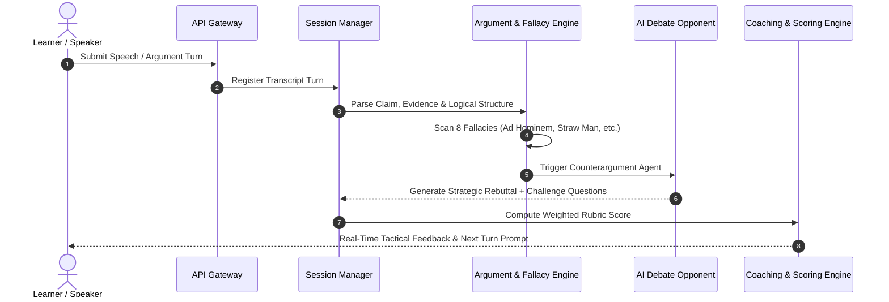

# Agentic AI Debate Coach & Presentation Analysis Platform
## System Architecture Design Document (Milestone 1)

### 1. Executive Summary & Objective
The **Agentic AI Debate Coach & Presentation Analysis Platform** is an enterprise-grade artificial intelligence solution engineered to evaluate arguments, detect logical fallacies, assess speech/presentation delivery, simulate high-stakes debate opponents, and generate personalized coaching pathways for learners, coaches, educators, and enterprise leaders.

---

### 2. High-Level System Architecture Diagram

```mermaid
flowchart TD
    subgraph ClientLayer ["Client Layer (Presentation & Interaction)"]
        UI_Learner["Learner Portal (Dashboard, Live Debate, Rebuttals)"]
        UI_Coach["Coach Portal (Student Reviews, Evaluation Rubrics)"]
        UI_Educator["Educator Portal (Class Analytics, Cohort Rankings)"]
        UI_Admin["Admin Console (System Metrics, Model Gateways)"]
    end

    subgraph APIGateway ["API Gateway & Security Layer (FastAPI)"]
        AUTH["JWT & OAuth2 Auth Engine"]
        RBAC["Role-Based Access Controller (Learner, Coach, Educator, Admin)"]
        RATE["Rate Limiting & Request Sanity"]
        CORS["CORS & Secure Transport"]
    end

    subgraph ServiceLayer ["Core Service & Business Logic"]
        SVC_USER["User & Profile Service"]
        SVC_SKILL["Skill Matrix & Tracking Engine"]
        SVC_SESSION["Debate Session Manager (6 Debate Formats)"]
        SVC_ARG["Argument Mining & Fallacy Engine (Milestones 2)"]
        SVC_AGENT["Agentic Debate Simulation Engine (Milestone 3)"]
        SVC_SPEECH["Presentation & Speech Analytics (Milestone 4)"]
        SVC_SCORE["Performance Scoring & Weighted Rubrics"]
    end

    subgraph AgenticCore ["Agentic AI Reasoning Engine (Milestone 3 & 4)"]
        LLM_ROUTER["Multi-LLM Dispatcher (OpenAI / HuggingFace)"]
        FALLACY_AGENT["Fallacy Detection Agent (8 Canonical Fallacies)"]
        REBUTTAL_AGENT["Socratic & Rebuttal Generation Agent"]
        OPPONENT_AGENT["Adaptive AI Debate Opponent (Oxford/Parliamentary)"]
        COACH_AGENT["Personalized Feedback & Learning Path Planner"]
    end

    subgraph StorageLayer ["Persistence & Analytics Layer"]
        PG_DB[("Relational DB: PostgreSQL / SQLite\n(Users, Profiles, Formats, Sessions, Turns)")]
        VECTOR_DB[("Vector Storage (FAISS / Chroma)\n(Argument Embeddings, Evidence Base)")]
        CACHE[("Session & State Cache")]
    end

    ClientLayer --> APIGateway
    APIGateway --> ServiceLayer
    ServiceLayer --> AgenticCore
    ServiceLayer --> StorageLayer
    AgenticCore --> StorageLayer
```

---

### 3. Core Architectural Modules

#### 3.1 Authentication & Role-Based Access Control (RBAC)
- **Token Format:** Cryptographically signed JSON Web Tokens (JWT) using HMAC-SHA256 (`HS256`).
- **Password Security:** Direct `bcrypt` key derivation with automated salt generation.
- **Roles:**
  1. `Learner`: Participates in debates, reviews personal feedback, tracks skill progression.
  2. `Debate Coach`: Facilitates sessions, provides custom rubrics, conducts 1-on-1 critiques.
  3. `Educator`: Manages cohorts/classes, views aggregate analytics and competitive leaderboards.
  4. `Administrator`: Manages user lifecycles, configures LLM providers, inspects audit logs.

#### 3.2 User Profile & Skill Tracking Engine
- **Profile Parameters:**
  - `experience_level`: Novice, Intermediate, Advanced, Champion.
  - `preferred_topics`: Ethics, Artificial Intelligence, Global Economics, Climate Policy, Law & Governance, Healthcare, Science & Society.
  - `presentation_domains`: Keynote, Startup Pitch, Academic Lecture, TED-Style, Competitive Debate.
  - `learning_goals` & `coaching_preferences`: Socratic Inquiry, Fallacy Minimization, Speaking Clarity, Persuasion Amplification.
- **Skill Competency Metrics (0 - 100):**
  - Argument Quality (30% weight)
  - Evidence Strength & Usage (20% weight)
  - Logical Consistency & Fallacy Resistance (20% weight)
  - Rebuttal Effectiveness (15% weight)
  - Communication, Clarity & Pacing (15% weight)

#### 3.3 Debate Session Management Engine
Supports 6 distinct debate frameworks:
1. **One-on-One Debate:** Direct proposition vs. opposition rebuttal duel.
2. **Parliamentary Debate:** Prime Minister, Leader of Opposition, Whips with Points of Information (POI).
3. **Oxford Debate:** Formal resolution with pre- and post-debate audience voting swings.
4. **Policy Debate:** Heavy evidence focus, plan vs. counterplan frameworks.
5. **Public Forum Debate:** Accessible, crossfire questioning rounds.
6. **AI Debate Simulation:** Autonomous agent opponent dynamically calibrating argumentation difficulty.

---

### 4. Agentic AI Pipeline (Roadmap for Milestones 2 - 4)

---

### 5. Non-Functional Requirements & Security
- **Confidentiality:** All transcripts and speech models are isolated by tenant/user credentials.
- **Latency Target:** Sub-80ms API response time for session metadata; sub-1.5s streaming LLM token generation.
- **Extensibility:** Loosely coupled architecture with SQLAlchemy repository patterns allowing effortless migration from SQLite to PostgreSQL.
