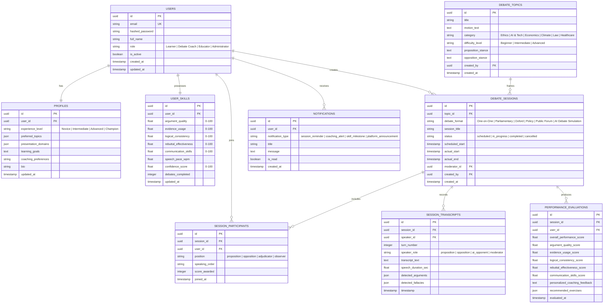

# Agentic AI Debate Coach & Presentation Analysis Platform
## Database Schema Specification (Milestone 1)

### 1. Entity-Relationship Overview

---

### 2. Table Specifications & Constraints

#### 2.1 Table: `users`
| Column | Type | Constraints | Description |
|---|---|---|---|
| `id` | `VARCHAR(36)` | PRIMARY KEY | Unique UUID identifier |
| `email` | `VARCHAR(255)` | UNIQUE, NOT NULL | Account email for credentials |
| `hashed_password` | `VARCHAR(255)` | NOT NULL | Salted bcrypt password hash |
| `full_name` | `VARCHAR(120)` | NOT NULL | User's display / legal name |
| `role` | `VARCHAR(32)` | NOT NULL, DEFAULT 'Learner' | One of: Learner, Debate Coach, Educator, Administrator |
| `is_active` | `BOOLEAN` | DEFAULT TRUE | Account state |
| `created_at` | `DATETIME` | DEFAULT UTC_NOW | Registration timestamp |
| `updated_at` | `DATETIME` | DEFAULT UTC_NOW | Last modified timestamp |

#### 2.2 Table: `profiles`
| Column | Type | Constraints | Description |
|---|---|---|---|
| `id` | `VARCHAR(36)` | PRIMARY KEY | Unique UUID identifier |
| `user_id` | `VARCHAR(36)` | FOREIGN KEY (`users.id`), UNIQUE | Associated user |
| `experience_level` | `VARCHAR(32)` | DEFAULT 'Novice' | Novice, Intermediate, Advanced, Champion |
| `preferred_topics` | `JSON` | NULLABLE | Array of topic tags (Ethics, AI, Economics...) |
| `presentation_domains` | `JSON` | NULLABLE | Array of domains (Pitch, Keynote, Oxford...) |
| `learning_goals` | `TEXT` | NULLABLE | Specific mastery targets |
| `coaching_preferences` | `VARCHAR(64)` | DEFAULT 'Socratic & Balanced' | Coaching style |
| `bio` | `TEXT` | NULLABLE | User bio / background description |
| `updated_at` | `DATETIME` | DEFAULT UTC_NOW | Last profile update |

#### 2.3 Table: `user_skills`
| Column | Type | Constraints | Description |
|---|---|---|---|
| `id` | `VARCHAR(36)` | PRIMARY KEY | Unique UUID identifier |
| `user_id` | `VARCHAR(36)` | FOREIGN KEY (`users.id`), UNIQUE | Associated user |
| `argument_quality` | `FLOAT` | DEFAULT 50.0 | Argument construction strength (0-100) |
| `evidence_usage` | `FLOAT` | DEFAULT 50.0 | Factual citation & empirical backing (0-100) |
| `logical_consistency` | `FLOAT` | DEFAULT 50.0 | Fallacy resistance & syllogistic rigor (0-100) |
| `rebuttal_effectiveness`| `FLOAT` | DEFAULT 50.0 | Counterargument sharpness (0-100) |
| `communication_skills` | `FLOAT` | DEFAULT 50.0 | Delivery, clarity, confidence (0-100) |
| `speech_pace_wpm` | `FLOAT` | DEFAULT 135.0 | Average speech tempo (words/min) |
| `confidence_score` | `FLOAT` | DEFAULT 60.0 | Aggregate confidence metric (0-100) |
| `debates_completed` | `INTEGER` | DEFAULT 0 | Count of completed sessions |
| `updated_at` | `DATETIME` | DEFAULT UTC_NOW | Last skill recalibration |

#### 2.4 Table: `debate_topics`
| Column | Type | Constraints | Description |
|---|---|---|---|
| `id` | `VARCHAR(36)` | PRIMARY KEY | Unique UUID identifier |
| `title` | `VARCHAR(200)` | NOT NULL | Short title |
| `motion_text` | `TEXT` | NOT NULL | Formal debate motion ("This House Would...") |
| `category` | `VARCHAR(64)` | NOT NULL | Ethics, AI, Economics, Climate, Law, Healthcare |
| `difficulty_level` | `VARCHAR(32)` | DEFAULT 'Intermediate' | Beginner, Intermediate, Advanced |
| `proposition_stance`| `TEXT` | NULLABLE | Summary rationale for Proposition |
| `opposition_stance` | `TEXT` | NULLABLE | Summary rationale for Opposition |
| `created_by` | `VARCHAR(36)` | FOREIGN KEY (`users.id`) | Creator ID |
| `created_at` | `DATETIME` | DEFAULT UTC_NOW | Creation timestamp |

#### 2.5 Table: `debate_sessions`
| Column | Type | Constraints | Description |
|---|---|---|---|
| `id` | `VARCHAR(36)` | PRIMARY KEY | Unique UUID identifier |
| `topic_id` | `VARCHAR(36)` | FOREIGN KEY (`debate_topics.id`) | Assigned debate topic |
| `debate_format` | `VARCHAR(64)` | NOT NULL | One of 6 formats |
| `session_title` | `VARCHAR(200)` | NOT NULL | Display title for the session |
| `status` | `VARCHAR(32)` | DEFAULT 'scheduled' | scheduled, in_progress, completed, cancelled |
| `scheduled_start` | `DATETIME` | NOT NULL | Planned start time |
| `actual_start` | `DATETIME` | NULLABLE | Actual timestamp started |
| `actual_end` | `DATETIME` | NULLABLE | Actual timestamp ended |
| `created_by` | `VARCHAR(36)` | FOREIGN KEY (`users.id`) | Host user ID |
| `created_at` | `DATETIME` | DEFAULT UTC_NOW | Creation timestamp |

#### 2.6 Table: `session_participants`
| Column | Type | Constraints | Description |
|---|---|---|---|
| `id` | `VARCHAR(36)` | PRIMARY KEY | Unique UUID identifier |
| `session_id` | `VARCHAR(36)` | FOREIGN KEY (`debate_sessions.id`) | Associated session |
| `user_id` | `VARCHAR(36)` | FOREIGN KEY (`users.id`) | Participating user |
| `position` | `VARCHAR(32)` | NOT NULL | proposition, opposition, adjudicator, observer |
| `speaking_order` | `INTEGER` | DEFAULT 1 | Speaker position index |
| `score_awarded` | `FLOAT` | NULLABLE | Overall awarded score |
| `joined_at` | `DATETIME` | DEFAULT UTC_NOW | Join timestamp |

---

### 3. Database Indexes for High-Concurrency Performance
1. `users(email)` - Unique B-Tree index for instantaneous authentication.
2. `debate_sessions(status, scheduled_start)` - Composite index for dashboard scheduling queries.
3. `session_participants(session_id, user_id)` - Composite index for fast membership validation.
4. `user_skills(user_id)` - Fast 1:1 lookup for real-time coach feedback.
