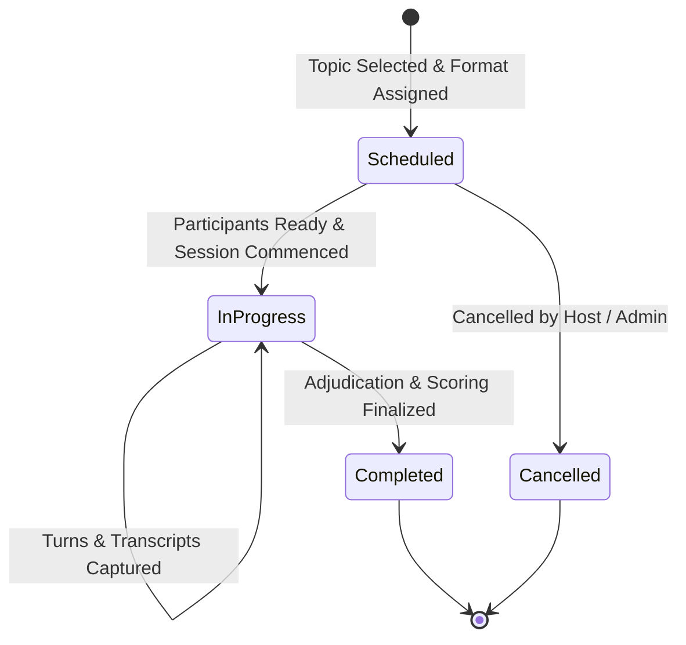

# Agentic AI Debate Coach & Presentation Analysis Platform
## Workflows, User Journeys & UI Wireframes (Milestone 1)

### 1. Core Platform Workflows

#### Workflow A: Learner Onboarding & Skill Calibration
1. **User Sign-up:** User registers with email, password, full name, and selects primary role (`Learner`).
2. **Profile Creation:** User specifies:
   - Experience Level: Novice, Intermediate, Advanced, Champion.
   - Preferred Topics: Ethics, AI, Economics, Climate, Law, Healthcare.
   - Presentation Domains: Pitch, Keynote, Academic, Debate.
   - Learning Goals: e.g. "Eliminate straw man fallacies, sharpen cross-examination rebuttals."
3. **Skill Matrix Initialization:** Base communication and debate metrics initialized (Argument Quality, Evidence Usage, Logical Consistency, Rebuttal Effectiveness, Communication Skills).

#### Workflow B: Debate Session Lifecycle


#### Workflow C: Role-Based Access Workflow Matrix
| Capability | Learner | Debate Coach | Educator | Administrator |
|---|---|---|---|---|
| Register & Login | Yes | Yes | Yes | Yes |
| Manage Personal Profile & Skills | Yes | Yes | Yes | Yes |
| Browse Debate Topics | Yes | Yes | Yes | Yes |
| Create New Debate Topics | - | Yes | Yes | Yes |
| Schedule Debate Sessions | Yes | Yes | Yes | Yes |
| Assign Positions (Prop / Opp) | Yes (Self) | Yes (Any) | Yes (Any) | Yes (Any) |
| Review Performance Reports | Own | Cohort | Class | All Platform |
| Manage System Users & LLM Config | - | - | - | Yes |

---

### 2. UI Wireframes & Layout Blueprints

#### 2.1 Wireframe: Authentication & Role Selection
```
+------------------------------------------------------------------------+
|                      AGENTIC AI DEBATE COACH                           |
|       "Master Persuasive Reasoning & Presentation Excellence"          |
+------------------------------------------------------------------------+
|                                                                        |
|    [ Login ]  /  [ Register ]                                          |
|                                                                        |
|    Full Name:      [ John Doe                                      ]   |
|    Email Address:  [ learner@debatecoach.ai                        ]   |
|    Password:       [ ****************                              ]   |
|                                                                        |
|    Select Platform Role:                                               |
|    (o) Learner        ( ) Debate Coach                                 |
|    ( ) Educator       ( ) Administrator                                |
|                                                                        |
|    [ Create Account / Sign In ]                                        |
|                                                                        |
|    -- Demo Quick Access --                                             |
|    [ Demo: Learner ] [ Demo: Coach ] [ Demo: Educator ] [ Demo: Admin ]|
+------------------------------------------------------------------------+
```

#### 2.2 Wireframe: User Profile & Skill Matrix Dashboard
```
+------------------------------------------------------------------------+
| [DebateAI]  Dashboard  |  Sessions  |  Topics  |  Profile   | [User: J. Doe]|
+------------------------------------------------------------------------+
|  PROFILE & SKILL INTELLIGENCE                                          |
|                                                                        |
|  +-- User Profile Card ---------+  +-- Skill Competency Radar --------+|
|  | Name: John Doe               |  | Argument Quality:      [==== 82%]||
|  | Role: Learner                |  | Evidence Usage:        [===  70%]||
|  | Level: Intermediate          |  | Logical Consistency:   [==== 88%]||
|  | Preferred Topics:            |  | Rebuttal Effectiveness:[===  74%]||
|  |  [AI & Tech] [Ethics] [Econ] |  | Communication Skills:  [==== 80%]||
|  | Presentation Domain: Keynote |  | Average Pace: 138 WPM (Optimal)  ||
|  | [Edit Profile Details]       |  | Confidence Rating: 78%           ||
|  +------------------------------+  +----------------------------------+|
|                                                                        |
|  +-- Active Learning Goals -------------------------------------------+|
|  | Target: Master Oxford debate rebuttal techniques.                   |
|  | Coaching Style: Socratic questioning & rigorous fallacy detection. |
|  +--------------------------------------------------------------------+|
+------------------------------------------------------------------------+
```

#### 2.3 Wireframe: Debate Session Management & Lobby
```
+------------------------------------------------------------------------+
|  DEBATE SESSIONS & SCHEDULING                                          |
|  [+ Schedule New Debate]   [+ Create Debate Motion]                    |
|                                                                        |
|  Filter by Format: [All Formats v]  Filter by Status: [Scheduled v]   |
|                                                                        |
|  +-- Session Card ---------------------------------------------------+ |
|  | Title: Oxford Duel: Autonomous AI Ethics                          | |
|  | Format: Oxford Debate | Status: [SCHEDULED]                       | |
|  | Motion: "This House Would Hold Frontier AI Developers Strictly     | |
|  |         Liable For Autonomous System Harms"                       | |
|  | Scheduled: Today at 18:00 UTC | Participants: 2 / 2               | |
|  | Position: [ Proposition: John Doe ] vs [ Opposition: AI Opponent ]| |
|  | [Join Session Lobby]   [Edit Details]   [Cancel Session]          | |
|  +-------------------------------------------------------------------+ |
+------------------------------------------------------------------------+
```

#### 2.4 Wireframe: Create / Schedule Debate Session Modal
```
+------------------------------------------------------------------------+
|  SCHEDULE DEBATE SESSION                                               |
|                                                                        |
|  Session Title:  [ Championship Preparation Round 1                  ] |
|  Debate Topic:   [ AI Alignment vs Open-Source Freedom             v] |
|  Debate Format:  [ Parliamentary Debate                             v] |
|                  (One-on-One | Parliamentary | Oxford | Policy |       |
|                   Public Forum | AI Debate Simulation)                 |
|  Scheduled Time: [ 2026-10-12  15:30                                 ] |
|                                                                        |
|  Assign My Position:                                                   |
|  (o) Proposition / Affirmative                                         |
|  ( ) Opposition / Negative                                             |
|  ( ) Adjudicator / Observer                                            |
|                                                                        |
|  [ Cancel ]                                       [ Confirm & Schedule]|
+------------------------------------------------------------------------+
```
