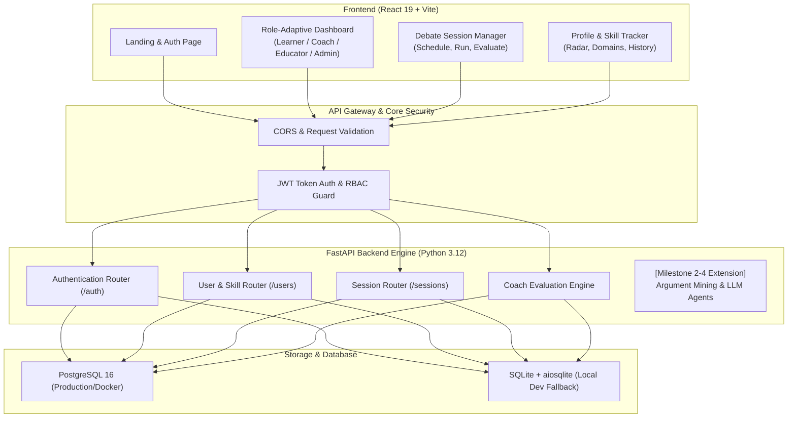
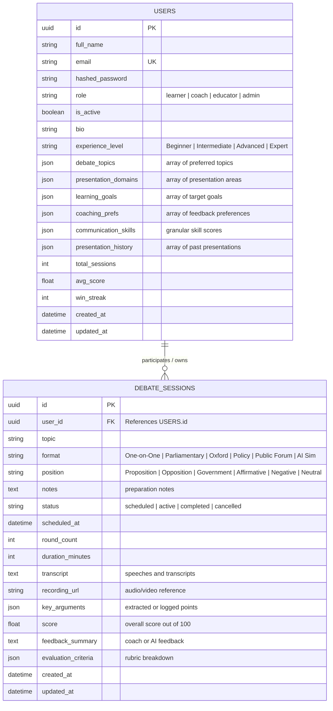
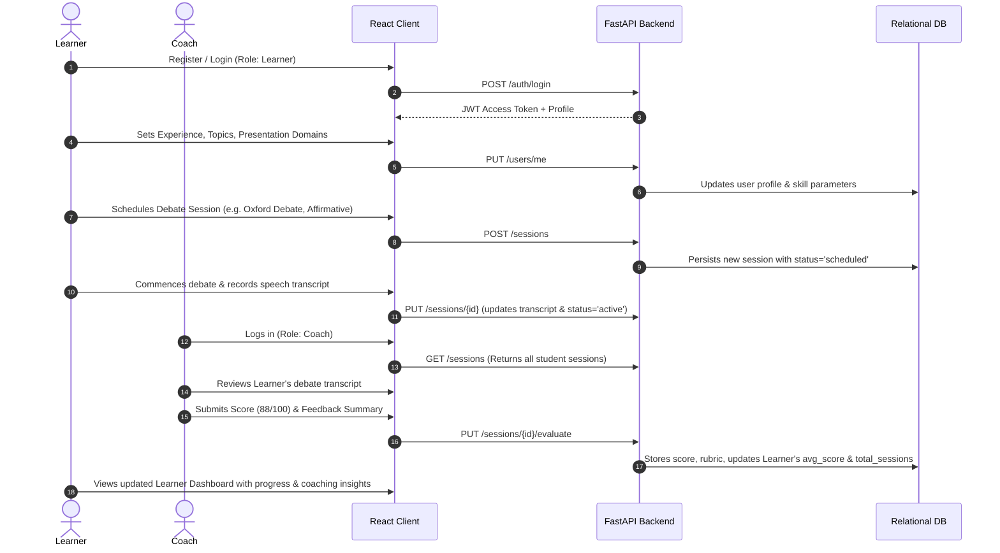

# 🏛️ DebateCoach AI — Milestone 1: System Architecture, Design Process & Workflows

**Project:** Agentic AI Debate Coach & Presentation Analysis Platform  
**Milestone:** Milestone 1 (Week 1 & 2) — Project Initialization, Design Process & Core Setup  
**Document Version:** 1.0.0  

---

## 1. Project Objectives & Executive Summary

The **DebateCoach AI** platform empowers users to cultivate debating, public speaking, critical thinking, and persuasive presentation skills through an agentic AI ecosystem.

### Core Objectives for Milestone 1:
1. **Core Workflows**: Define and establish user journeys for debate practice, presentation analysis, coaching evaluation, and multi-round argument handling.
2. **System Architecture**: Multi-tier architecture encompassing a React single-page frontend, an asynchronous FastAPI backend, relational persistence with role-based segregation, and foundational hooks for future Agentic LLM reasoning engines (Milestones 2–4).
3. **Authentication & RBAC**: JWT-based authentication with 4 distinct roles: **Learner**, **Debate Coach**, **Educator**, and **Administrator**.
4. **User Profile & Skill Tracking Integration**: Track communication skill metrics (clarity, evidence strength, logical consistency, persuasiveness, speaking pace, confidence), presentation domains, debate topics, learning goals, and session histories.
5. **Debate Session Management**: End-to-end lifecycle for creating, scheduling, position assignment, transcript/speech recording, and coach evaluation across 6 international debate formats.

---

## 2. Supported Debate Formats & Rules

| Format | Structure | Key Dynamic | Target Skills |
|---|---|---|---|
| **One-on-One Debate** | 2 speakers, alternating speeches & rebuttals | Head-to-head agility | Direct clash, rapid rebuttal |
| **Parliamentary Debate** | Government vs. Opposition, points of information (POIs) | Dynamic parliamentary discourse | Spontaneous thinking, rhetoric |
| **Oxford Debate** | Proposition vs. Opposition with audience pre/post vote | Persuasion of a jury | Audience sway, formal structure |
| **Policy Debate** | Problem-solution oriented, affirmative plan vs. negative counterplan | In-depth evidence analysis | Research rigor, evidence cards |
| **Public Forum Debate** | Accessible current events topic, crossfire rounds | Broad accessibility | Civility, crossfire questioning |
| **AI Debate Simulation** | Learner vs. Adaptive AI Agent with automated difficulty scaling | Solo practice & sparring | Tenacity, logical endurance |

---

## 3. High-Level System Architecture

---

## 4. Database Schema Design (Entity-Relationship)

---

## 5. Role-Based Access Control (RBAC) Matrix

| Resource & Action | Learner | Debate Coach | Educator | Admin |
|---|:---:|:---:|:---:|:---:|
| **Register & Login** | ✅ | ✅ | ✅ | ✅ |
| **Manage Own Profile & Skill Settings** | ✅ | ✅ | ✅ | ✅ |
| **Create Personal Debate Session** | ✅ | ✅ | ✅ | ✅ |
| **View Personal Debate Sessions** | ✅ | ✅ | ✅ | ✅ |
| **View All Student Debate Sessions** | ❌ | ✅ | ✅ | ✅ |
| **Evaluate & Score Student Sessions** | ❌ | ✅ | ✅ | ✅ |
| **View Class Analytics & Student Roster** | ❌ | ✅ | ✅ | ✅ |
| **Delete Any Session** | ❌ (Own only) | ❌ (Own only) | ❌ (Own only) | ✅ |
| **System-wide Management** | ❌ | ❌ | ❌ | ✅ |

---

## 6. AI-Powered Debate Coaching Workflow

---

## 7. UI Wireframe Concepts

### Wireframe A: Role-Adaptive Dashboard
- **Top Bar**: Platform title, live date/time, user role pill, session quick-links.
- **Top Stats Ribbon**: 4 metric cards customized by role (e.g., Learner: Sessions, Avg Score, Win Streak, Improvement Rate; Coach: Active Students, Reviews Pending, Today's Sessions).
- **Primary Grid (Left 65%)**: Recent Debate Sessions table with format badges, dates, statuses, and quick review/open buttons.
- **Side Panel (Right 35%)**: 
  - Quick Actions widget (New Session, My Sessions, Update Skills).
  - Performance Gauge & Communication Skill Radar showing score progression.

### Wireframe B: Profile & Skill Tracking Center
- **Section 1**: Basic info (Name, Email, Role badge, Bio).
- **Section 2**: Experience Level selector buttons (Beginner, Intermediate, Advanced, Expert).
- **Section 3**: Communication Skill Tracking Metrics (Live interactive score cards for Clarity, Evidence Strength, Logical Consistency, Rebuttal Skill, Delivery Pace, Confidence).
- **Section 4**: Preferred Debate Topics multi-select chips.
- **Section 5**: Presentation Domains multi-select chips (Keynote, Academic, Business Pitch, Political Debate, etc.).
- **Section 6**: Learning Goals & Coaching Preferences.

### Wireframe C: Debate Session Command Center
- **Header**: Status filter tabs (`All`, `Scheduled`, `Active`, `Completed`) with dynamic count badges + "+ New Session" button.
- **Session List**: Rich cards with format icon, topic title, format label, scheduled date/time, status badge, and action triggers.
- **New Session Modal**: Topic prompt, format selector (all 6 formats), position selector, datetime picker, preparation notes.
- **Session Detail & Evaluation Modal**:
  - Metadata breakdown (Topic, Format, Position, Date).
  - Transcript / speech notes viewer and input.
  - Evaluation panel for Coaches: Numeric score input (0–100), feedback summary, and one-click save.
